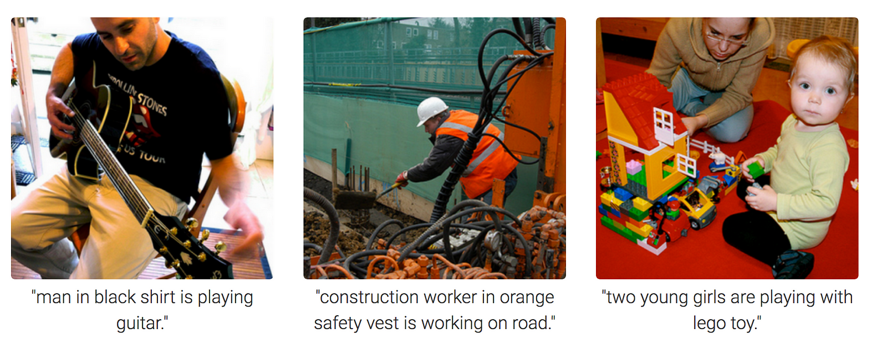

Here's the updated README:

---

# 📸 Image Caption Generator with CNN and LSTM 🚀

Welcome to the **Image Caption Generator** project! This repository showcases an innovative deep learning model that seamlessly blends Convolutional Neural Networks (CNNs) and Long Short-Term Memory (LSTM) networks to create descriptive captions for images. 




## 🔥 Key Features
- **Deep Learning Magic**: Combines CNNs for powerful image feature extraction with LSTMs for coherent caption generation.
- **Powered by PyTorch**: Built using the PyTorch framework, making the implementation flexible and easy to extend.
- **COCO Dataset**: Utilizes the popular COCO dataset, known for its diverse and richly annotated images, to train and evaluate the model.

## 📚 How It Works
1. **Image Processing with CNNs**: The CNN component of the model processes the input images, extracting high-level features that represent the visual content.
2. **Caption Generation with LSTMs**: These features are then passed to the LSTM network, which generates a natural language description of the image.
3. **End-to-End Learning**: The model is trained end-to-end, ensuring that the captions generated are closely aligned with the visual content.

## 🎉 Why This Project?
The Image Caption Generator is an exciting demonstration of how AI can bridge the gap between visual understanding and language generation. It's a perfect project for anyone interested in deep learning, computer vision, or natural language processing.

## 📦 Getting Started
1. Clone this repository:
   ```
   git clone https://github.com/your-username/image-caption-generator.git
   ```
2. Set up your environment with the necessary dependencies. Make sure you have PyTorch and any other required libraries installed.

3. Run the model on sample images and enjoy the results!

## 🚀 Future Enhancements
- **More Data**: Explore additional datasets to further improve caption quality.
- **Advanced Architectures**: Experiment with more sophisticated neural network architectures to push the boundaries of what's possible.

## 🤝 Contributing
We welcome contributions! Please read our [contributing guidelines](CONTRIBUTING.md) for more information.

## 📝 License
This project is licensed under the Apache License 2.0 - see the [LICENSE](LICENSE) file for details.

---

Feel free to add any specific instructions for setting up the environment or additional details you think might be helpful!
